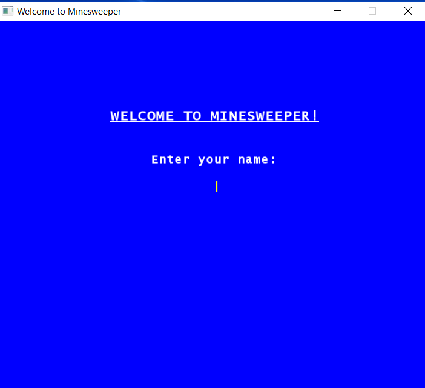
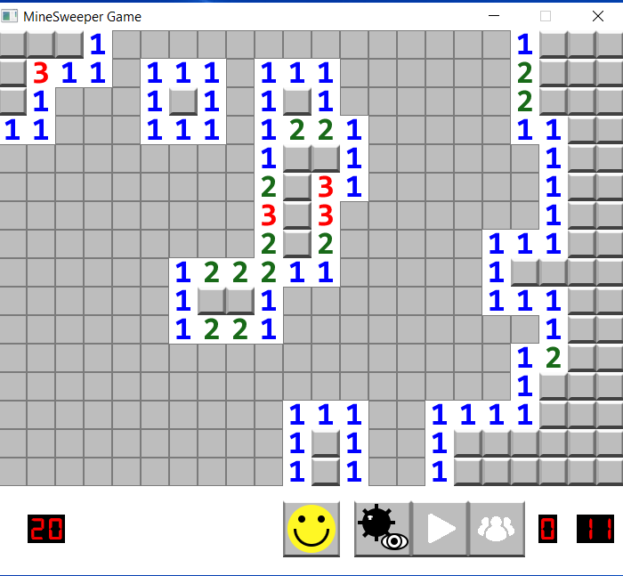
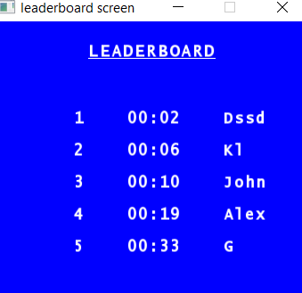

# Navodya16-Minesweeper-game-in-C-

This is Minesweeper game developed using C++ and SFML
The game has welcome screen, game window and leaderboard interfaces

welcome screen

game window

leaderboard

how to run:

install sfml and mingw

include correct sfml library path to as yours in the makefile

in the terminal type, mingw32-make (for systems mingw and sfml installed)
